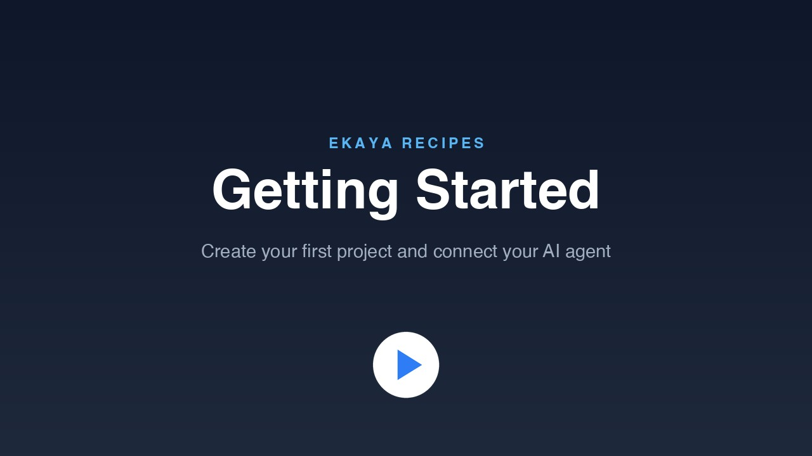

# Getting Started

Create your first Ekaya project and connect it to your AI agent.

[](https://cdn.ekaya.ai/recipes/getting-started.mp4)

[Watch the video](https://cdn.ekaya.ai/recipes/getting-started.mp4), about two minutes long, or [watch it in full resolution](https://cdn.ekaya.ai/recipes/getting-started-1080p.mp4).

## What you will do

1. Sign up for Ekaya, or sign in if you already have an account.
2. Create a project from the Projects page. Choose Ekaya Cloud, give the project a name, and select Create project.
3. On the Setup screen, leave Full permissions turned on and connect your AI agent.

## Connect your agent

The Setup screen has short instructions for each agent: Claude Code, Claude Desktop, Claude Chat, Claude Cowork, Codex, VS Code, and any other client that supports MCP servers. Follow the instructions for the agent you use.

In Claude Code, you copy the command from Setup and run it in your terminal. Then start Claude Code, run `/mcp`, select `ekaya`, and sign in through your browser.

## Prompt

Once your agent is connected, paste this into it:

```text
Use Ekaya to help me set up this project.
Check where the project stands, ask me what I want to achieve,
and walk me through each next step.
```
