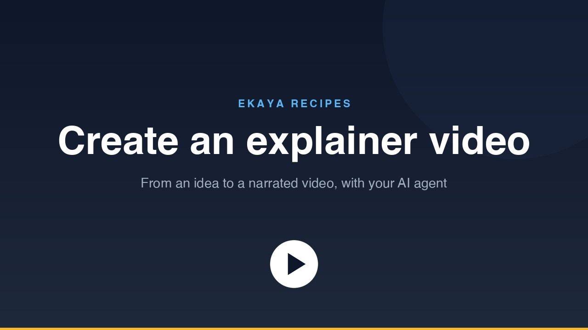

# Create an explainer video

Turn an idea into a short narrated video. You say what the video should explain. Your agent writes the script, gets the narration from ElevenLabs through Ekaya, and builds the video on your computer.

[](https://cdn.ekaya.ai/recipes/create-video.mp4)

[Watch the video](https://cdn.ekaya.ai/recipes/create-video.mp4), under two minutes long, or [watch it in full resolution](https://cdn.ekaya.ai/recipes/create-video-1080p.mp4). It was made with this Recipe.

## Before you start

- Finish [Getting Started](../../getting-started/). You then have an Ekaya project, and Claude Code is connected to it.
- Have an ElevenLabs account and an API key from it. The free plan works with ElevenLabs' default voices. Voices from its Voice Library need a paid plan.

## What you will do

1. Start Claude Code in the folder where you connected it to Ekaya, and paste the prompt below.
2. Tell Claude what the video should explain, and who it is for.
3. Open the link Claude gives you, and enter your ElevenLabs API key on that page. Do not paste the key into the conversation.
4. Read the script Claude writes, ask for changes, and choose a voice.
5. Watch the video. To change it, ask Claude. Only the scenes you change are narrated again.

The video is built by a small program that Claude downloads from this folder. It needs Python and a free tool named ffmpeg. If your computer is missing one of them, Claude tells you and asks before it installs anything.

## Prompt

```text
Use Ekaya to help me create a narrated explainer video.
Follow the steps for agents in this Recipe:
https://github.com/ekaya-inc/ekaya-recipes/tree/main/media/create-video
Start by asking me what the video should explain,
and ask before you install anything on my computer.
```

## Another voice

This Recipe uses ElevenLabs. To use a different voice service, or your computer's own voice for a quick draft, tell Claude. The program only needs one audio clip for each scene.

## For your agent

These steps are for the AI agent that the prompt was pasted into. They assume that Ekaya's MCP server is connected and that you can run commands on the person's computer.

1. **Ask first.** What should the video explain, who is it for, and how long should it be? 60 to 90 seconds suits most explainers. That is 150 to 220 words of narration.

2. **Get the generator.** Make a folder for the video, and download [`generate.py`](generate.py) into it:

   ```sh
   mkdir -p explainer-video && cd explainer-video
   curl -fsSLO https://raw.githubusercontent.com/ekaya-inc/ekaya-recipes/main/media/create-video/generate.py
   python3 generate.py check
   ```

   `check` installs nothing. It reports whether the computer has Python 3.9 or later, Pillow, and ffmpeg. If something is missing, tell the person what it is and which command installs it, and run that command only after they agree. Install Pillow into a virtual environment in the video's folder, with the command that `check` prints, not into the system Python.

3. **Write the script.** `python3 generate.py init` writes a starter `scenes.json`. The top of `generate.py` describes every field. Write a title card, three to six scenes, and an end card. A scene has a headline, up to four short points, and two to four sentences of narration. Give a point an `at` (words from the narration), and it appears as those words are spoken. Show the person the script with `python3 generate.py script`, and change it until they approve it. Do not make any narration before that, because each clip uses the person's ElevenLabs credits.

   On a Mac, `python3 generate.py draft` and then `python3 generate.py render --preview` give a rough cut in the computer's own voice, at no cost.

4. **Connect ElevenLabs in Ekaya.** Call `describe_project`. If the project has no ElevenLabs datasource yet:

   - Call `create_service_datasource` with `provider: "composio_elevenlabs"`, and give the person the `human_link` that it returns. They enter their ElevenLabs API key on that page. Never ask for the key in the conversation.
   - Ekaya announces new tools after this step. If they are missing from your tool list, ask the person to reconnect Ekaya's MCP server. In Claude Code, they run `/mcp`, select `ekaya`, and reconnect.
   - Call `get_datasource_connection` until its `status` is `ready`.
   - Ekaya now holds a pending Request for most ElevenLabs operations, but not for text to speech. Find it with `search_connector_tools` (search for `speech`), and add `ELEVENLABS_TEXT_TO_SPEECH` with `select_connector_tools`. Do this before you read the pending Requests, because selecting a tool replaces them and gives them new IDs.
   - Read the pending Requests with `list_query_suggestions`. The list has more than one page. Approve only these, with `approve_query_suggestions` and `effect_attestation: "READ"`: `ELEVENLABS TEXT TO SPEECH`, `ELEVENLABS GET VOICES`, `ELEVENLABS GET VOICE`, and `ELEVENLABS GET USER SUBSCRIPTION INFO`. The video needs nothing else. A Request that stays pending cannot run.

5. **Choose a voice.** `list_approved_requests` gives the ID of each approved Request. Run a Request with `execute_approved_request`.

   - If the person has a voice in mind from ElevenLabs, ask for its name or ID, and confirm it with `ELEVENLABS GET VOICE`.
   - `ELEVENLABS GET VOICES` lists the voices on the person's account. The answer is large. Read only each voice's `name`, `voice_id`, `category`, and `preview_url`, which the person can listen to.
   - If the person has no preference, use `iP95p4xoKVk53GoZ742B` ("Chris"). It is one of ElevenLabs' default voices, so it works on the free plan.
   - A voice from the Voice Library needs a paid ElevenLabs plan. `ELEVENLABS GET USER SUBSCRIPTION INFO` shows the plan and how many characters are left.

   Put the voice's `voice_id` and `voice_name` in `scenes.json`, under `voice`.

6. **Narrate.** `python3 generate.py status --json` lists each scene's state and the exact `text` to voice. For each scene that is `missing` or `stale`, run the text-to-speech Request with that `text`, and with `voice_id`, `model_id`, `seed`, and `voice_settings` from `scenes.json`. The answer holds a link to the audio in `document.file.s3url`. The link expires after one hour, so download it at once to `audio/<scene id>.mp3`. Then run `python3 generate.py stamp <scene id>`.

   If a Request fails, call `get_execution` with its `execution_id` and the datasource's ID. The answer gives ElevenLabs' own reason.

7. **Render.** Run `python3 generate.py render --preview` for a quick check, and then `python3 generate.py render`. Tell the person where the video file is. `python3 generate.py poster` writes a still image of the title card.

8. **Make changes.** Edit `scenes.json`, run `python3 generate.py status`, narrate only the scenes that it reports, and render again. A scene whose narration did not change keeps its clip.

The person may prefer another voice service, or the computer's own voice. Use it: the generator needs only `audio/<scene id>.mp3` for each scene, and then `stamp`.
